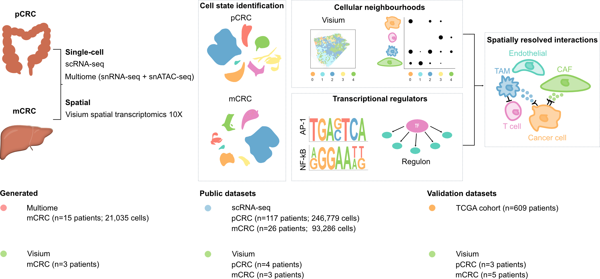
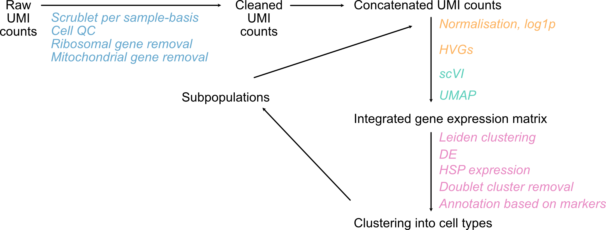
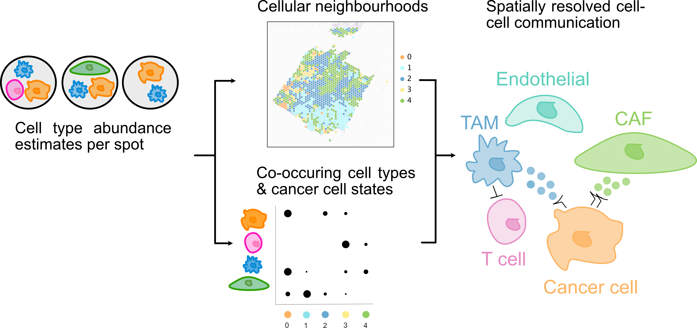
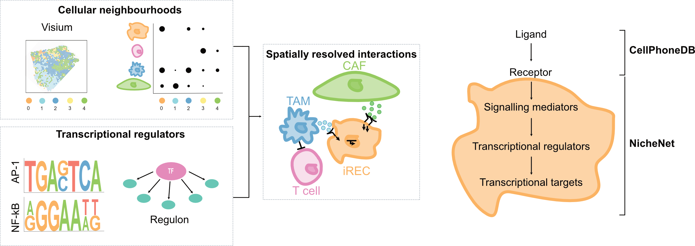

# Spatial patterns in colorectal cancer metastasis

An arc bridging the gap from raw data to integrated spatial insights in patients with colorectal cancer metastasis. To date, metastasis remains the prevailing cause of cancer-related death in colorectal cancer (CRC) patients. CRC has undergone extensive genomic study showing low genomic divergence between primary (pCRC) and metastatic (lmCRC) tumours resected from the same patients. Metastasis-initiating cells (MICs) exhibit a profound transcriptional reprogramming from tumour-initiating cells, pointing to the role of plasticity in CRC progression and metastasis. However, the features and drivers of cancer cell plasticity in lmCRC need to be further characterised in order to improve patient treatment and outcome. Spatial transcriptomic profiles of multiple samples offer the possibility to interrogate how the cancer cells states and the TME interact, deciphering recurrent patterns among samples derived from patients. 

Using a combination of single-cell multi-omics, large-scale RNA-seq and spatial transcriptomics data derived from patient pCRC and mCRC tumours, the overarching aim of this project is to investigate the spatial landscape of cancer cell states and tumour microenvironment (TME) at the primary and the metastatic site at a fine-grained transcriptomic level. We characterise the transcriptional landscape of the TME of pCRC and lmCRC tumours, with the effort to build a comprehensive single-cell RNA-sequencing reference for spatial transcriptomics data. We identify cancer cells with regenerative and inflammatory signatures (iRECs) that are transcriptionally similar to MICs in CRC mouse models. 

Using the spatial transcriptomic profiles of multiple samples, we interrogate how the cancer cell states and the TME interact, deciphering recurrent patterns among patient samples and spatially segregated cancer cell states. We show colocalisation of (i)RECs with immunosuppressive and inflammatory tumour-associated macrophages (TAMs), extracellular matrix (ECM) remodelling cancer-associated fibroblasts (CAFs) and myofibroblasts at the invasive edge in pCRC. Similarly in lmCRC iRECs reside in a spatial niche with SPP1+ TAMs, IL1B+ TAMs, myofibroblasts and ECM CAFs, suggesting their phenotype could be mediated by cellular crosstalk. 

Finally, we identify ligand-receptor interactions mediated by CAFs, immunosuppressive and inflammatory TAMs that shape the inflammatory regenerative programme in CRC malignant cells in liver metastases.

## Overview
This project includes workflows covering data preprocessing, quality control, scRNA-seq/snRNA-seq integration (via scVI), dimensionality reduction, clustering, spatial deconvolution (cell2location), spatial niche inference and cell-cell communication (CellPhoneDB, NicheNet). Code for my [PhD thesis](https://qmro.qmul.ac.uk/xmlui/handle/123456789/103970) and for our [preprint](https://doi.org/10.21203/rs.3.rs-3846377/v1).

<figure>

<figcaption>
    Overview of the computational workflow. Schematic describing the computational analysis done in this project. To infer the spatial arrangement of cancer cell states and TME cells defined by scRNA-seq data, I coupled scRNA-seq data to spatial transcriptomics data (10X Visium), revealing cellular niches and spatial interactions associated with specific spatial niches.
  </figcaption>
</figure>

   <!-- Force a line break -->

## Data Requirements

The pipeline relies on multiple datasets:

- Public scRNA-seq data for primary CRC (pCRC) and metastatic CRC (mCRC)
- In-house 10X Multiome data (snRNA-seq + snATAC-seq) generated by colleague Dr Sam Ogden
- 10X Visium spatial transcriptomics data (in-house and/or publicly available)
- RNA-seq data from TCGA

## Dependencies

`.yml` files are provided in `vens/` folder. Key libraries include (but are not limited to):
- Python 3.8+
- Scanpy
- scVI-tools
- Scrublet
- CellPhoneDB
- NicheNet (R package)
- cell2location
- SpatialDE2
- Squidpy
- ArchR (for snATAC-seq in R)
- SCENIC+ (Python + R)
- GSEApy
- Other standard scientific libraries (NumPy, SciPy, pandas, matplotlib, seaborn, statsmodels etc.)
- vistools which can be found here https://github.com/Nasrine26/vistools

Make sure that you have GPU support if running scVI or large scale cell2location analyses. All pipelines were run on high performance clustering (HPC) clusters to efficiently handle large datasets (for scVI and cell2location with GPU support).

## Repository Structure

- `ccc/`: Directory for cell-cell communication analysis for lmCRC
- `scrna-seq/`: Directory for single cell RNA-seq analysis, single-nuclei RNA-seq analysis, RNA-seq analayis for pCRC and lmCRC
- `spatial/`: Directory for spatial analysis for pCRC and lmCRC
- `venvs/`: yml files for envs used

## Analysis Workflow Overview

**Raw Data Ingestion**
- Load `.h5ad` or `.mtx` files for scRNA-seq/spatial transcripotmics
- Load TCGA RNA-seq data, normalise and preprocess
  
**Quality Control**
- Filter low-quality cells/nuclei (mito < 20%, genes > 300, etc.)
- Identify doublets
  
**Integration & Dimensionality Reduction**
- scVI: Variational autoencoder for batch correction and latent embedding. I align multiple scRNA-seq/snRNA-seq datasets while adjusting for patient and technical covariates. 
  
**Visualisation & Clustering**
- KNN graph (k varies) → UMAP → Leiden (r varies)
- Identify major cell types, iterative sub-clustering for TME compartments. I leverage Leiden clustering, differential expression with the Wilcoxon rank-sum test, and canonical marker genes to annotate major cell types and sub-clusters.

<figure>

<figcaption>
    Overview of scRNA-seq analysis workflow. Each count matrix was preprocessed individually. Doublet detection method Scrublet was applied. Individual count matrices were filtered to remove low quality cells. The combined count matrix was then analysed via the Scanpy pipeline, reducing the dimensionality of the data and batch-correcting the data with scVI. Data are visualised with UMAP in a two-dimensional embedding. Unsupervised clus- tering with Leiden community detection method was performed on KNN graph to identify major cell populations and subsequently, the same integration and clustering analysis was ap- plied iteratively to the cells of each major cell type separately to identify and annotate TME cell states.
  </figcaption>
</figure>

   <!-- Force a line break -->
  
**Spatial Transcriptomics**
- Map scRNA-seq–derived cell states with cell2location
- Segment tissue with SpatialDE2 and cell type mRNA count estimates to identify spatial niches

<figure>

<figcaption>
    Overview of spatial niche identification workflow. Schematic describing the analysis of the spatial organisation of pCRC and lmCRC samples and identification of local niches surrounding cancer cell states. To elucidate the influence of TME on cancer cell states in pCRC and lmCRC samples, we require better understanding of the tumour architecture. Cell2location was applied to assign cell types to spots by integrating scRNA-seq and ST transcriptomes, yielding cell type abundance estimates per spot. Subsequently, I deciphered local niches surrounding the cancer cell states and identified spatially co-occurring cell types by spatially clustering on the cell type abundance estimates per spot across samples.
  </figcaption>
</figure>

   <!-- Force a line break -->

**Cell-Cell Interaction Analysis**
- CellPhoneDB, NicheNet for ligand-receptor and downstream TF network
- TF regulons, co-accessibility (snATAC + snRNA) were estimated with SCENIC+ by colleague Dr Sam Ogden

<figure>

<figcaption>
    Overview of cell communication analysis workflow. Schematic describing the cell communication analysis in lmCRC samples after identification of a spatial niche surrounding iRECs. Combining CellPhoneDB and NicheNet methods, the analysis identified potential ligands from TME subpopulations in the iREC spatial niche predicted to induce expression of AP-1 and NF-κB regulons.
  </figcaption>
</figure>

   <!-- Force a line break -->

**Statistical Tests & Survival**
- Differential expression (Wilcoxon)
- Gene/Pathway enrichment analysis with GSEApy, and Molecular Signatures Database (MSigDB) hallmark gene set (2020) and KEGG pathway gene sets (2021 Human)
- Spearman/Pearson correlation of cell state proportions
- Kruskal-Wallis for cell type enrichment analysis across histopathological regions and spatial niches
- Spatial ligand enrichment analysis
- Kaplan-Meier analysis for clinical outcome and niche signatures
- Clinical staging and cancer cell state signatures association.
